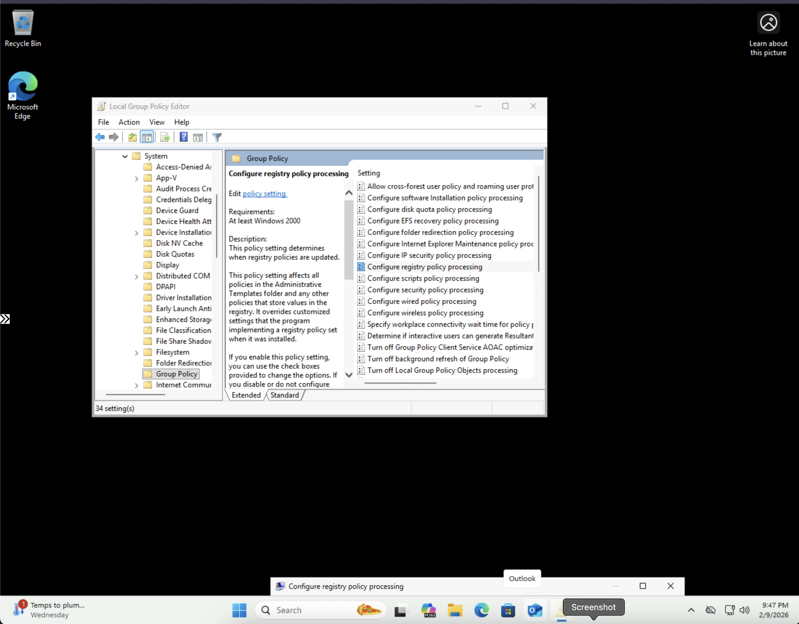
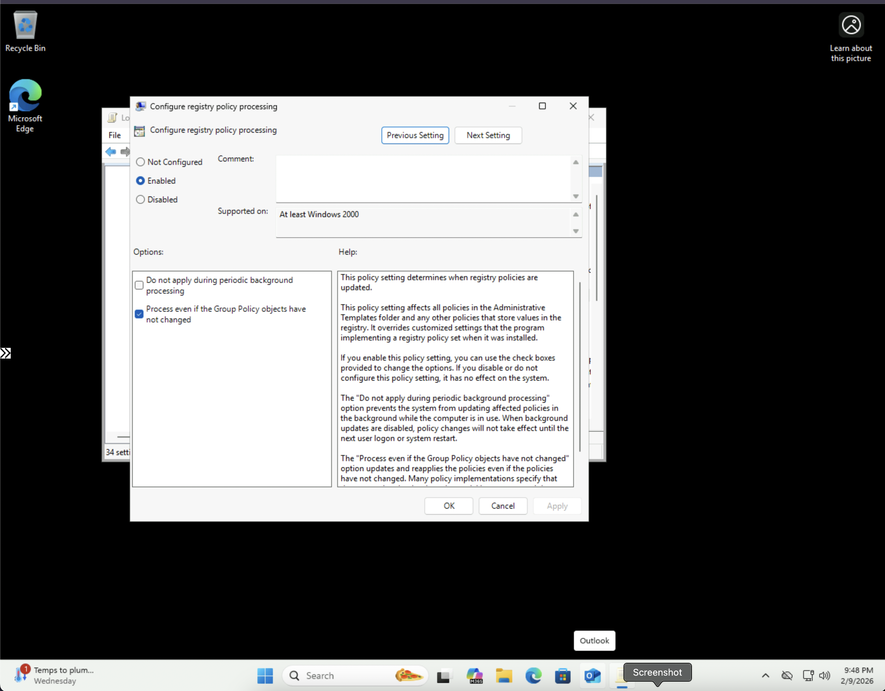
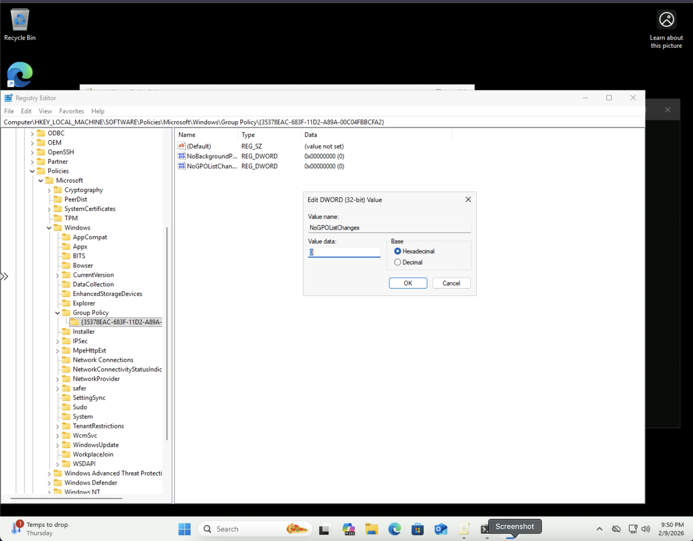
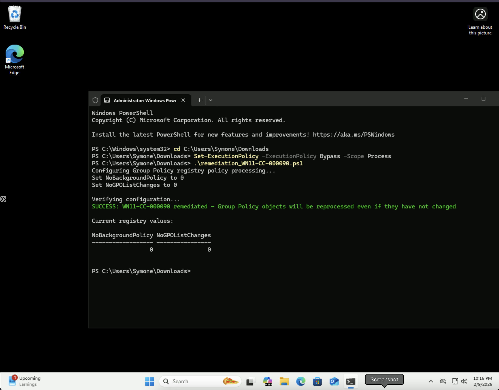

# Windows STIG WN11-CC-000090 Remediation

## Overview
This repository contains remediation for STIG vulnerability WN11-CC-000090: "Group Policy objects must be reprocessed even if they have not changed."

## Vulnerability Details
- **STIG-ID**: WN11-CC-000090
- **Vuln-ID**: V-253373
- **Severity**: CAT II
- **Description**: Enabling this setting ensures registry policies are reprocessed even if Group Policy objects haven't changed. This ensures policy settings remain enforced and prevents unauthorized modifications from persisting.

## Remediation Methods

### Automated (PowerShell Script)
Run the `remediation_WN11-CC-000090.ps1` script as Administrator to automatically configure the Group Policy registry processing settings.

**To run:**
```powershell
PS C:\> .\remediation_WN11-CC-000090.ps1
```

### Manual (Group Policy Editor)
1. Open Local Group Policy Editor (`gpedit.msc`)
2. Navigate to: `Computer Configuration` → `Administrative Templates` → `System` → `Group Policy`
3. Double-click **"Configure registry policy processing"**
4. Select **"Enabled"**
5. Check the box for **"Process even if the Group Policy objects have not changed"**
6. Click **Apply**, then **OK**
7. Open Command Prompt as Administrator and run: `gpupdate /force`
8. Verify in Registry Editor at: `HKEY_LOCAL_MACHINE\SOFTWARE\Policies\Microsoft\Windows\Group Policy\{35378EAC-683F-11D2-A89A-00C04FBBCFA2}`

## Screenshots

### Group Policy Configuration (Step 1)


### Group Policy Configuration (Step 2)


### Manual Verification - Group Policy Update


### Manual Verification - Registry Editor


### PowerShell Automated Remediation Success


## Testing Information
- **Tested By**: Symone-Marie Priester
- **Date Tested**: February 8, 2025
- **System**: Windows 11 Pro (Version 10.0.26200.7623)
- **PowerShell Version**: 5.1
- **Methods**: Both automated (PowerShell) and manual (Group Policy Editor)

## Repository Structure
```
├── remediation_WN11-CC-000090.ps1              # PowerShell remediation script
├── Configure_registry_policy_processing.png    # Group Policy navigation
├── Configure_registry_policy_processing2.png   # Group Policy settings
├── WN11-CC-000090__force_update.png           # Manual gpupdate verification
├── WN11-CC-000090_verify_solution.png         # Registry verification
├── Programmatic_WN11-CC-000090_sucess.png     # PowerShell remediation success
└── README.md                                   # This file
```

## Author
**Symone-Marie Priester**
- LinkedIn: [linkedin.com/in/symone-mariepriester](https://linkedin.com/in/symone-mariepriester)
- GitHub: [github.com/Symone-Marie](https://github.com/Symone-Marie)
